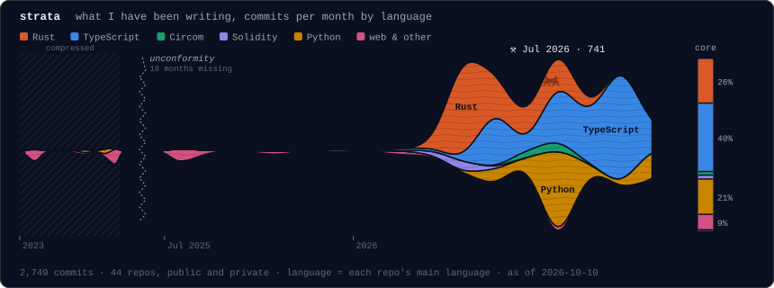
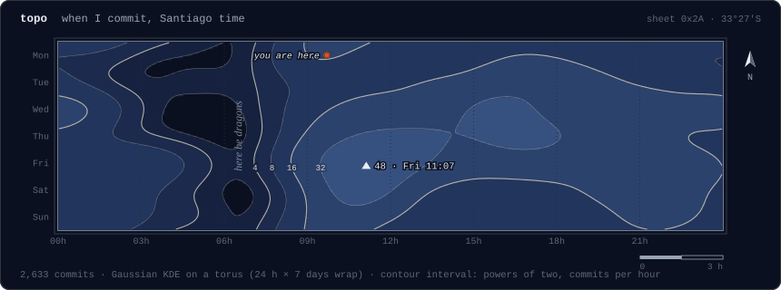

I'm Manuel. I write Rust and build AI systems where the model proposes and something deterministic decides: a compiler, a test suite, the kernel, a smart contract. From Chile 🇨🇱.

### 🦀 Making agents safe to run

- 📦 **[ClawCrate](https://github.com/manuelpenazuniga/ClawCrate)**: sandbox for agent commands and MCP servers. Landlock, seccomp, Seatbelt. No Docker, no root, receipts included.
- 🪙 **[PennyPrompt](https://github.com/manuelpenazuniga/PennyPrompt)**: your agent is a loop with a credit card. This is the hard stop.
- 🐕 **[CerberusGuard](https://github.com/manuelpenazuniga/CerberusGuard)**: three heads (prompts, money, syscalls) and one audit trail.

### 🧠 LLMs on a short leash

- 🌀 **[HIPnosis](https://github.com/manuelpenazuniga/HIPnosis)**: ports CUDA to ROCm. It doesn't get to grade its own homework; an MI300X does.
- 🩺 **[Clinibrium](https://github.com/manuelpenazuniga/Clinibrium)**: vertigo triage. Claude can raise urgency, never lower it. Built during *Built with Claude: Life Sciences*.
- 🔌 **[vertigoDx](https://github.com/manuelpenazuniga/vertigoDx)**: same problem, fully offline on Gemma 4. Patient data never leaves the laptop.
- ⚒️ **[LaForja](https://github.com/manuelpenazuniga/LaForja)**: students write exam problems, and LLMs try to break them.

### ⛓️ Contracts that say no

- 🌾 **[Ohu](https://github.com/manuelpenazuniga/ohu)**: an LLM swarm runs the co-op; a Casper contract holds the money.
- 🗣️ **[VeritasVoice](https://github.com/manuelpenazuniga/veritasvoice)**: anonymous feedback, with Groth16 verified inside a Soroban contract.
- 🎬 **[HollyWars](https://github.com/manuelpenazuniga/HollyWars-SolanaZK-edition)**: ZK voting on Solana. Your indentation style decides your vote weight.
- 🛰️ **[chainSentinel](https://github.com/manuelpenazuniga/chainSentinel)**: watches Polkadot DeFi and pulls the funds out before the exploit lands.

### 🌱 Side projects

- 📐 **[EntrenaTuPAES](https://entrenatupaes.cl/)**: a university-entrance exam prep academy I co-founded. I wrote its LMS.

### 🐾 Volunteer

- 🐶 **[Fundación Rescate de Mascotas](https://fundacionrescatedemascotas.cl/en-memoria)**: I built the foundation's donation platform. A gift in someone's memory funds a specific rescued dog, and you can follow it until it's adopted.

### 🏔️ Away from the keyboard

📷 shooting medium-format film &nbsp;·&nbsp; ☕ dialing in pour-over &nbsp;·&nbsp; 🥾 trekking the Andes &nbsp;·&nbsp; 🦙 alpacas, always

### 🪨 Field notes

<samp>[linkedin](https://www.linkedin.com/in/manuelpz-dev/) · [telegram](https://t.me/manuelpenazuniga)</samp>
